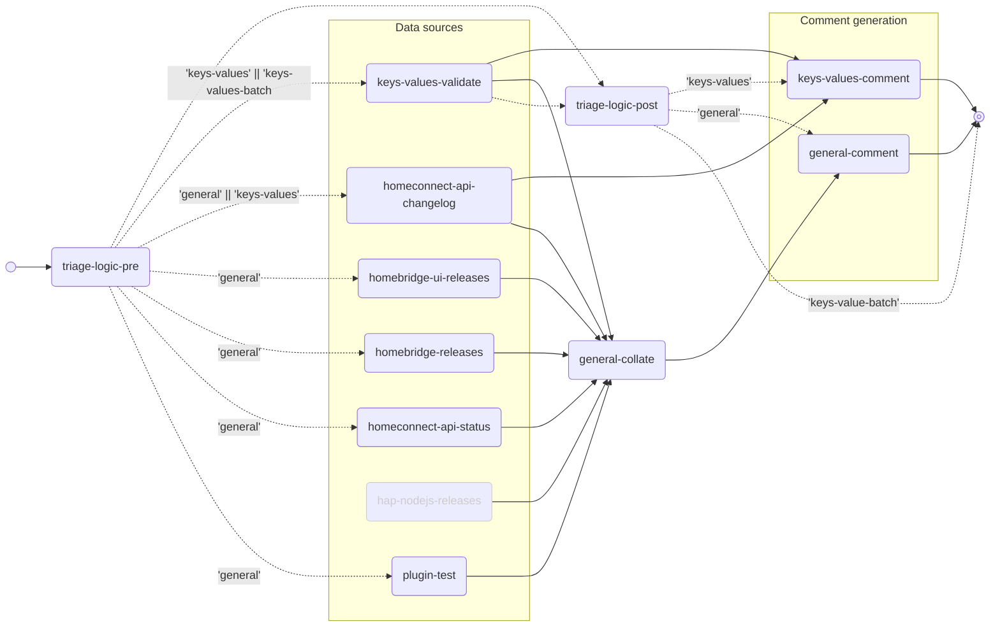

# `triage-issue.yml`

## Jobs Overview

```mermaid
flowchart LR

  classDef disabled stroke:#CCC,color:#CCC;

  start@{ shape: sm-circ, label: "Start" }
  stop@{ shape: framed-circle, label: "Stop" }

  tlpre(triage-logic-pre)
  tlpost(triage-logic-post)
  
  subgraph Data sources
  pt(plugin-test)
  hcac(homeconnect-api-changelog)
  hcas(homeconnect-api-status)
  hbrel(homebridge-releases)
  hbuirel(homebridge-ui-releases)
  haprel(hap-nodejs-releases):::disabled
  kvval(keys-values-validate)
  end

  gcol(general-collate)

  subgraph Comment generation
  gcom(general-comment)
  kvcom(keys-values-comment)
  end

  start --> tlpre
  tlpre -. 'general' .-> pt
  tlpre -. 'general' .-> hcas
  tlpre -. 'general' .-> hbrel
  tlpre -. 'general' .-> hbuirel
  tlpre -. 'general' || 'keys-values' .-> hcac
  tlpre -. 'keys-values' || 'keys-values-batch .-> kvval

  tlpre -.-> tlpost
  kvval -.-> tlpost

  tlpost -. 'keys-value-batch' .-> stop

  tlpost -. 'general' .-> gcom
  pt --> gcol
  hcas --> gcol
  hbrel --> gcol
  hbuirel --> gcol
  haprel --> gcol
  hcac --> gcol
  kvval --> gcol
  gcol --> gcom
  gcom --> stop

  tlpost -. 'keys-values' .-> kvcom
  kvval --> kvcom
  hcac --> kvcom
  kvcom --> stop
```